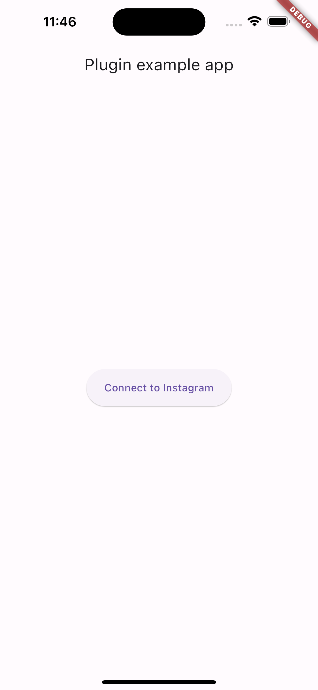
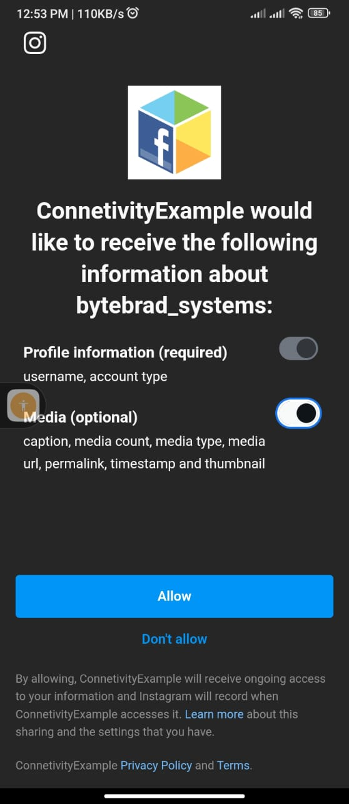

# Instagram Login/Connect


This package is intended to let developers easily integrate instagram integration in Flutter Application. We will be using `Instagram Basic Display API`. Currently it is supporting the following:

- Connect to Instagram 
- Get Access Token for a particular user
- Get `userid` and `username`

## Upcoming Features

- Profile details in terms of (captions, email, etc)
- Get User Posts & Reels
- Download Reels
- Complete Working support on Web, MacOS, Linux, & Windows Platform

## Getting started

```dart
dart pub add insta_login
```

```dart
import 'package:insta_login/insta_login.dart';
```

## Usage

```dart
import 'package:insta_login/insta_login.dart';
InstaView(
    instaAppId: '215643524910532',
    instaAppSecret:'b19d87bf98b632e0319f2ebab495b345',
    redirectUrl: 'https://ayesha-iftikhar.web.app/',
    onComplete: (_token, _userid, _username) {
        WidgetsBinding.instance.addPostFrameCallback(
        (timeStamp) {
            setState(() {
                token = _token;
                userid = _userid;
                username = _username;
            });
        });
    },
),
```


## Setup

- Create an app on [Facebook Developer Platform](), by selecting `other` and App Type as `Comsumer or other`.
- Enable `Instagram Basic Display API`, and from the bottom create an application that will be your instagram app whose appid and secret we will be using in our api calls.
- Add Some instagram accounts to test the integration but after adding the account accept the invitation from `Setting > App and Websites` in your instagram account. You can follow this [link](ttps://www.instagram.com/accounts/manage_access/) as well.
- On Facebook Developer Platform, Add your required platforms in the settings.
- _**Note:** The Platform setup is same as, we are suppose to setup our application for facebook login and other services._

<p align="center">
    
</p>


## Example

```dart
class MyApp extends StatefulWidget {
  const MyApp({super.key});

  @override
  State<MyApp> createState() => _MyAppState();
}

class _MyAppState extends State<MyApp> {
  String token = '', userid = '', username = '';

  @override
  Widget build(BuildContext context) {
    return MaterialApp(
      home: Scaffold(
        appBar: AppBar(title: const Text('Plugin example app')),
        body: Center(
          child: Padding(
            padding: const EdgeInsets.symmetric(vertical: 8.0, horizontal: 20),
            child: Column(
              mainAxisAlignment: MainAxisAlignment.center,
              children: [
                if (token != '' || userid != '' || username != '')
                  Text(
                    'Access Token: $token\n\nUser Id: $userid\n\nUsername: $username',
                  )
                else
                  SizedBox(
                    height: 50,
                    child: ElevatedButton(
                      onPressed: () {
                        Navigator.of(context).push(
                          MaterialPageRoute(
                            builder: (context) {
                              return InstaView(
                                instaAppId: '215643524910532',
                                instaAppSecret:
                                    'b19d87bf98b632e0319f2ebab495b345',
                                redirectUrl: 'https://ayesha-iftikhar.web.app/',
                                onComplete: (_token, _userid, _username) {
                                  WidgetsBinding.instance.addPostFrameCallback(
                                    (timeStamp) {
                                      setState(() {
                                        token = _token;
                                        userid = _userid;
                                        username = _username;
                                      });
                                    },
                                  );
                                },
                              );
                            },
                          ),
                        );
                      },
                      child: Text('Connect to Instagram'),
                    ),
                  ),
              ],
            ),
          ),
        ),
      ),
    );
  }
}
```

## Screenshots

<p align="center">
    
    
    
</p>